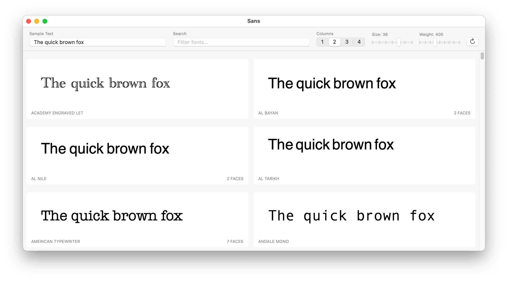

# Sans

A macOS app to preview sample text across all your installed fonts.



## Features

- Browse all installed font families in a card grid
- Adjust sample text, font size, weight, and column count
- Search fonts by name
- Right-click to copy font names or reveal in Finder

## Build & Run

Requires macOS 13+ and Swift 5.9+.

```bash
swift run
```

## License

[MIT](LICENSE)
