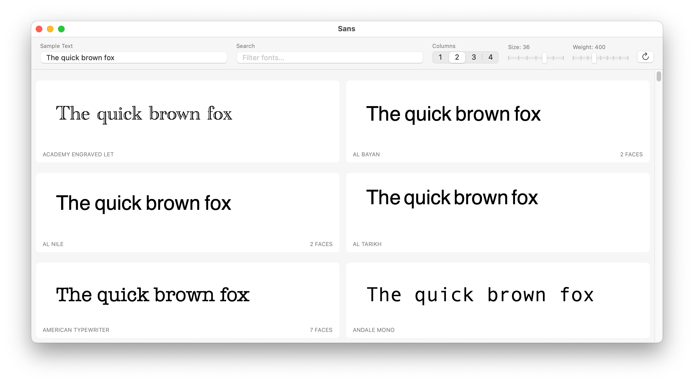

# Sans


A macOS app to preview sample text across all your installed fonts.



Requires macOS 15 (Sequoia) or later.

## Install

1. Open **Terminal** (press ⌘Space, type "Terminal", press Enter)
2. Copy and paste this command, then press Enter:

```sh
/bin/bash -c "$(curl -fsSL https://raw.githubusercontent.com/vladstudio/sans/main/install.sh)"
```

3. The app will install to /Applications and open automatically

---

License: MIT
